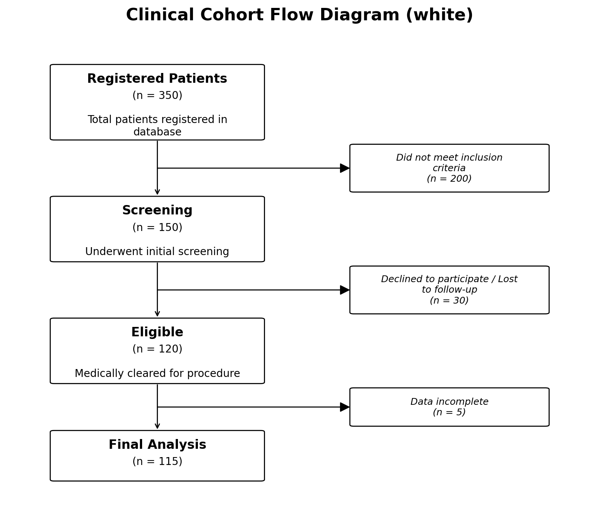

Customise
=========

Every visual aspect of the flow diagram — colours, fonts, spacing, box
geometry — is controlled by a TOML configuration file.  The package ships
with two built-in styles (``white`` and ``colorful``); you only need to
override the keys you want to change.

Built-in Styles
---------------

Select a style via the ``style`` parameter:

.. code-block:: python

   # Default: clean white boxes, no background colour
   fig, ax = plot_cohort_flow_diagram(data, style="white")

   # Pastel gradient backgrounds
   fig, ax = plot_cohort_flow_diagram(data, style="colorful")

.. raw:: html

   

   ``style="white"`` (default)

.. figure:: _static/clinical_flow_chart_colorful.png
   :alt: Colorful style
   :width: 100%

   ``style="colorful"``

.. raw:: html

   

Using a Custom Style File
-------------------------

Create a TOML file anywhere on disk, then pass its path when plotting:

.. code-block:: python

   fig, ax = plot_cohort_flow_diagram(
       data,
       style="colorful",               # base style
       style_config_path="my_style.toml",  # overrides on top
   )

Your file is **merged on top of** the chosen built-in style, so you only
need to include the sections and keys you want to change.

Configuration Sections
----------------------

Below is the complete default configuration with explanations.

``[figure]`` — Overall Figure
^^^^^^^^^^^^^^^^^^^^^^^^^^^^^

.. code-block:: toml

   [figure]
   figsize_width = 12        # minimum figure width (inches)
   figsize_height = 8        # minimum figure height (inches)
   dpi = 200                 # resolution (dots per inch)
   title_fontsize = 16       # figure title font size
   title_fontweight = "bold" # figure title weight
   title_pad = 20            # padding above the title (points)

``[layout]`` — Spacing & Widths
^^^^^^^^^^^^^^^^^^^^^^^^^^^^^^^^

.. code-block:: toml

   [layout]
   main_title_width = 26          # character wrap width for box titles
   main_text_width = 34           # character wrap width for body text
   exclusion_text_width = 30      # character wrap width for exclusion text
   main_box_width = 2.8           # main box width (data units)
   exclusion_box_width = 2.6      # exclusion box width
   base_gap = 0.8                 # minimum vertical gap between boxes
   side_gap = 1.2                 # horizontal gap to exclusion box
   top_margin = 0.8               # space above the first box
   bottom_margin = 0.8            # space below the last box
   x_padding = 0.6                # horizontal padding at canvas edges

``[box_geometry]`` — Box Sizing
^^^^^^^^^^^^^^^^^^^^^^^^^^^^^^^^

.. code-block:: toml

   [box_geometry]
   padding = 0.52               # internal padding factor
   title_line_height = 0.42     # vertical space per title line
   body_line_height = 0.33      # vertical space per body line
   title_body_gap = 0.16        # gap between title and body text
   text_top_padding = 0.24      # space from box top to first line
   min_main_height = 1.6        # minimum height of a main box
   min_exclusion_height = 1.2   # minimum height of an exclusion box
   clearance = 0.2              # extra clearance around exclusion boxes
   corner_radius = 0.05         # rounded corner radius
   pad_factor = 0.03            # FancyBboxPatch pad parameter

``[text]`` — Font Sizes
^^^^^^^^^^^^^^^^^^^^^^^^

.. code-block:: toml

   [text]
   fontsize_title = 12       # box title font size
   fontsize_main = 10        # box body font size
   fontsize_exclusion = 9    # exclusion box font size

``[lines]`` — Connectors & Arrows
^^^^^^^^^^^^^^^^^^^^^^^^^^^^^^^^^^^

.. code-block:: toml

   [lines]
   box_linewidth = 1           # box border width
   connector_linewidth = 1     # arrow line width
   arrow_mutation_scale = 20   # arrow-head size
   junction_radius = 0.004     # radius of the junction dot

``[colors]`` — Colour Gradient
^^^^^^^^^^^^^^^^^^^^^^^^^^^^^^^

.. code-block:: toml

   # "colorful" style defaults:
   [colors]
   allow_named_colors = true      # allow Matplotlib colour names
   main_start = "#dff1ff"         # gradient start for main boxes
   main_end = "#dff7e8"           # gradient end for main boxes
   exclusion_start = "#fee8e8"    # gradient start for exclusion boxes
   exclusion_end = "#f8cccc"      # gradient end for exclusion boxes

In the ``white`` style, all four colour values are ``"#ffffff"``.

Transparent Background
-----------------------

For embedding diagrams in presentations or posters, use the
``transparent`` option:

.. code-block:: python

   fig, ax = plot_cohort_flow_diagram(data, transparent=True)

Minimal Override Example
------------------------

To simply increase the DPI and use darker exclusion colours, create a file
like this:

.. code-block:: toml
   :caption: my_style.toml

   [figure]
   dpi = 300

   [colors]
   exclusion_start = "#ff9999"
   exclusion_end = "#cc3333"

All other values remain at their defaults.

Ad-Hoc Overrides via Keyword Arguments
---------------------------------------

A few settings can also be overridden directly in the function call without
touching any file:

.. code-block:: python

   fig, ax = plot_cohort_flow_diagram(
       data,
       dpi=300,
       figsize=(14, 10),
       main_palette=["#aec6cf", "#b5ead7", "#c7ceea"],
   )

The priority order is: **keyword arguments > custom TOML file > built-in
style defaults**.
