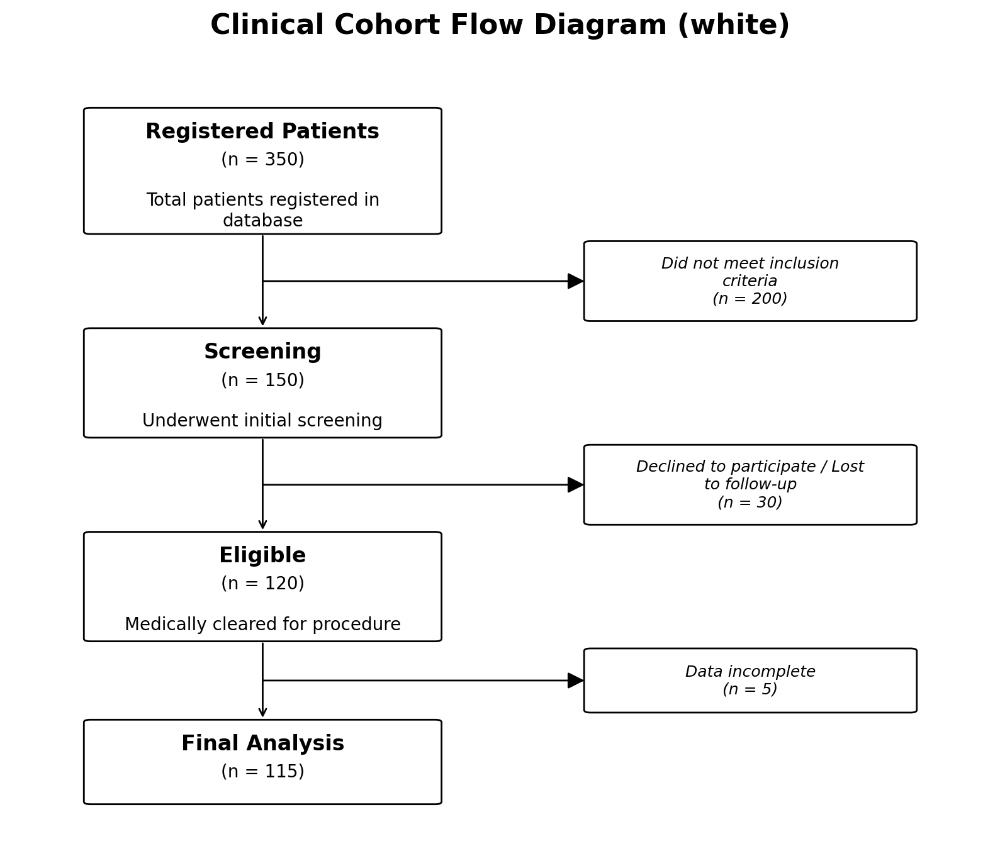
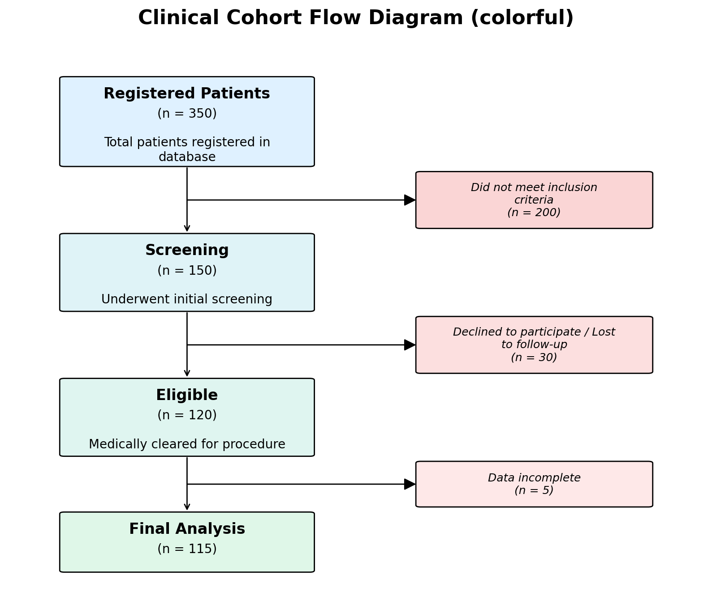
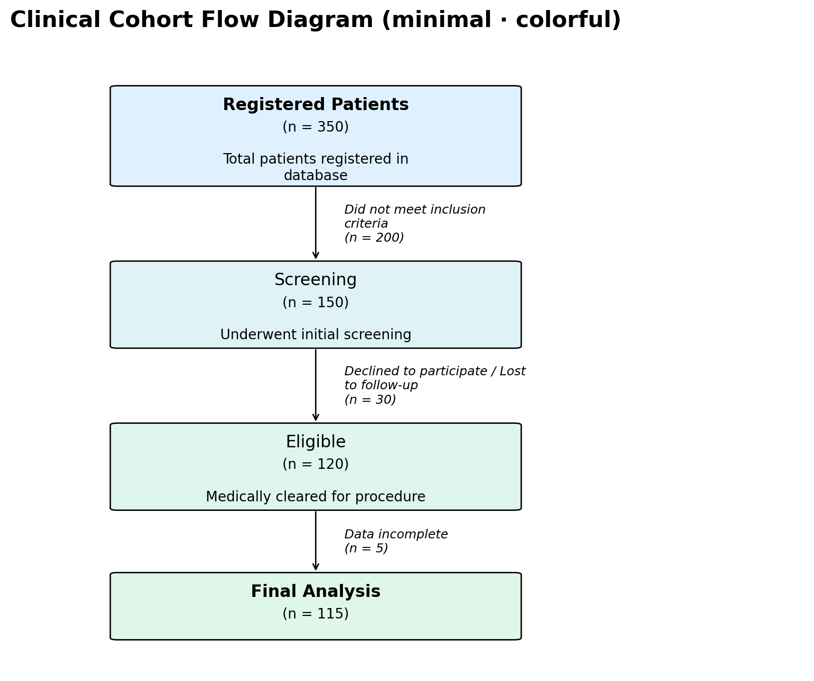
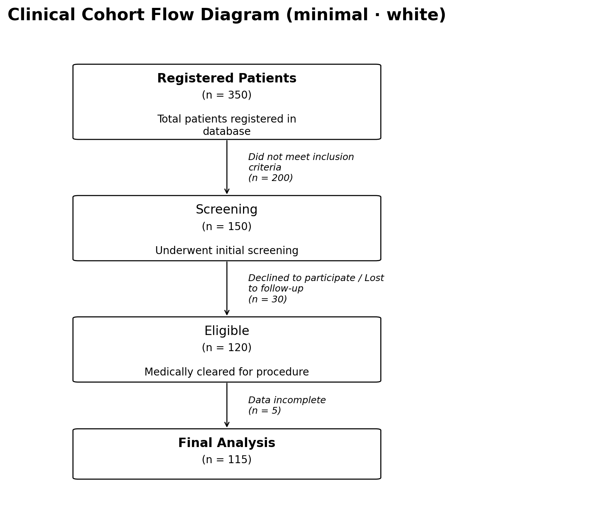

Getting Started
===============

Installation
------------

Install from PyPI with pip:

.. code-block:: bash

   pip install pycohortflow

The only hard dependency is **Matplotlib** (>= 3.5).  On Python versions
before 3.11, the lightweight ``tomli`` package is pulled in automatically so
that TOML configuration files work out of the box.

Quick Example
-------------

Create a Python script or Jupyter notebook and paste the following:

.. code-block:: python

   from pycohortflow import plot_cfd
   import matplotlib.pyplot as plt

   cohort_data = [
       {
           "heading": "Registered Patients",
           "description": "Total patients registered in database",
           "N": 350,
       },
       {
           "heading": "Screening",
           "description": "Underwent initial screening",
           "N": 150,
           "exclusion_description": "Did not meet inclusion criteria",
       },
       {
           "heading": "Eligible",
           "description": "Medically cleared for procedure",
           "N": 120,
           "exclusion_description": "Declined to participate / Lost to follow-up",
       },
       {
           "heading": "Final Analysis",
           "N": 115,
           "exclusion_description": "Data incomplete",
       },
   ]

   fig, ax = plot_cfd(
       cohort_data,
       figure_title="Clinical Cohort Flow Diagram",
   )
   plt.show()

This produces a vertical flow chart with automatic exclusion counts and
connecting arrows.  The default ``"white"`` style renders clean white boxes:

   Output using the default ``style="white"``.

Choosing a Built-in Style
--------------------------

Three styles are bundled with the package:

.. code-block:: python

   # Clean white boxes (default)
   fig, ax = plot_cfd(cohort_data, style="white")

   # Pastel gradient backgrounds
   fig, ax = plot_cfd(cohort_data, style="colorful")

   # Minimal: white boxes, normal-weight headings, italic side text
   # in place of an exclusion box.  Use per-node ``"color"`` and
   # ``"heading_fontweight": "bold"`` overrides to highlight the
   # first and last steps.
   fig, ax = plot_cfd(cohort_data, style="minimal")

   # Transparent figure background (useful for slides or posters)
   fig, ax = plot_cfd(cohort_data, transparent=True)

The ``"colorful"`` style applies pastel gradients to all boxes:

   Output using ``style="colorful"``.

The ``"minimal"`` style replaces the side-card exclusion box with
italic side text and uses normal-weight headings by default.  Per-node
``"color"`` and ``"heading_fontweight"`` overrides let you either
highlight just the start and end nodes (white middle nodes) or fill
every node with a pastel gradient that mirrors the ``colorful``
style:

.. raw:: html

   

   ``style="minimal"`` with a per-node pastel gradient.

   ``style="minimal"`` with all-white nodes.

.. raw:: html

   

Drawing into an Existing Axes
------------------------------

If you want to embed a flow chart inside a subplot layout, pass an
existing Matplotlib axes via the ``ax`` parameter.  The function will
draw into that axes instead of creating a new figure:

.. code-block:: python

   import matplotlib.pyplot as plt
   from pycohortflow import plot_cfd

   fig, axes = plt.subplots(1, 2, figsize=(20, 8))

   plot_cfd(cohort_data, ax=axes[0], figure_title="White")
   plot_cfd(cohort_data, ax=axes[1], style="colorful",
                            figure_title="Colorful")

   plt.tight_layout()
   plt.show()

When ``ax`` is provided the returned tuple is ``(ax.figure, ax)``, so the
caller keeps full control over the figure.

Saving to Disk
--------------

Pass ``save_dir``, ``img_name``, and optionally ``save_format`` to write
the figure directly:

.. code-block:: python

   fig, ax = plot_cfd(
       cohort_data,
       save_dir="output",
       img_name="my_flow_chart",
       save_format=["png", "svg", "pdf"],
       figure_title="My Study",
   )

Each format is written as a separate file inside the ``output/`` directory.

Supported Export Formats
^^^^^^^^^^^^^^^^^^^^^^^^

Matplotlib supports many output formats.  The most common ones are:

.. list-table::
   :header-rows: 1
   :widths: 15 20 65

   * - Format
     - Extension
     - Notes
   * - **PNG**
     - ``.png``
     - Raster image, best for on-screen viewing and web use.
   * - **SVG**
     - ``.svg``
     - Scalable vector graphic, ideal for publications and web embedding.
   * - **PDF**
     - ``.pdf``
     - Vector format, commonly used for LaTeX / print workflows.
   * - **PS**
     - ``.ps``
     - PostScript, for legacy print pipelines.
   * - **EPS**
     - ``.eps``
     - Encapsulated PostScript, often required by journal submissions.
   * - **JPEG**
     - ``.jpg`` / ``.jpeg``
     - Lossy raster format (not recommended for diagrams).
   * - **TIFF**
     - ``.tif`` / ``.tiff``
     - High-quality raster, sometimes required by publishers.
   * - **WebP**
     - ``.webp``
     - Modern web raster format (requires Pillow).
   * - **PGF**
     - ``.pgf``
     - PGF/TikZ vector format for direct LaTeX inclusion.
   * - **Raw / RGBA**
     - ``.raw`` / ``.rgba``
     - Uncompressed pixel data.

Pass any of these as a string or list to ``save_format``:

.. code-block:: python

   save_format=["png", "svg", "pdf", "eps", "tiff"]

Data Format
-----------

Every element in the ``data`` list is a dictionary with the following keys:

.. list-table::
   :header-rows: 1
   :widths: 25 10 65

   * - Key
     - Required
     - Description
   * - ``N``
     - Yes
     - Number of remaining participants at this step.
   * - ``heading``
     - No
     - Title displayed inside the box (defaults to ``"Step <i>"``).
   * - ``description``
     - No
     - Additional body text rendered below the title.
   * - ``exclusion_description``
     - No
     - Label for the exclusion side-box (defaults to ``"Excluded"``).
   * - ``color``
     - No
     - Override colour for this node (hex string or Matplotlib colour name).
   * - ``exclusion_color``
     - No
     - Override colour for the exclusion box.

The ``N`` values must be **non-increasing** — each step should have the
same or fewer participants than the previous one.

Next Steps
----------

* Customise the visual appearance using a TOML file — see :doc:`customise`.
* Explore the full Python API — see :doc:`api`.
* Build diagrams without installing Python — try the :doc:`Interactive Generator <generator>`.
