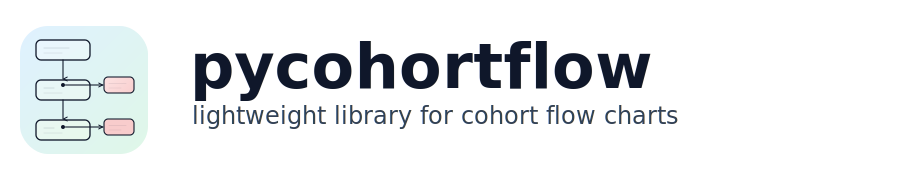

pycohortflow
=============

**Lightweight cohort flow diagrams built on Matplotlib.**

``pycohortflow`` lets you turn a plain Python list into a publication-ready
vertical flow chart in a single function call.  Colours, fonts, spacing,
and box geometry are fully customisable through TOML configuration files.

**Don't want to install anything?** Use the
:doc:`Interactive Generator <generator>` to **build diagrams directly in
your browser** and export them as SVG, PNG or PDF.

.. raw:: html

   

     

       <h3>Interactive Generator</h3>
       <ul>
         <li><a href="generator.html">Try it in the browser</a> — build diagrams without installing Python</li>
       </ul>
     

   

.. raw:: html

   

     
     
   

Quickstart
----------

.. code-block:: python

   from pycohortflow import plot_cfd

   data = [
       {"heading": "Registered", "N": 350},
       {"heading": "Screened", "N": 150,
        "exclusion_description": "Not eligible"},
       {"heading": "Analysed", "N": 120,
        "exclusion_description": "Lost to follow-up"},
   ]

   fig, ax = plot_cfd(data, figure_title="My Study")

.. raw:: html

   

     

       <h3>Documentation</h3>
       <ul>
         <li><a href="getting_started.html">Getting Started</a> — installation, quick example, data format</li>
         <li><a href="customise.html">Customise</a> — built-in styles, TOML configuration, overrides</li>
         <li><a href="development.html">Development</a> — local setup, testing, deployment</li>
       </ul>
     

     

       <h3>Python API</h3>
       <ul>
         <li><a href="api.html">Python API</a> — full API documentation</li>
         <li><a href="api_cfd.html">cfd — Plotting</a> — <code>plot_cfd</code></li>
         <li><a href="api_cfd_util.html">cfd_util — Utilities</a> — colours, config, helpers</li>
       </ul>
     

   

.. toctree::
   :maxdepth: 3
   :hidden:

   Getting Started <getting_started>

.. toctree::
   :maxdepth: 3
   :caption: Documentation
   :hidden:

   documentation

.. toctree::
   :maxdepth: 1
   :caption: Tools
   :hidden:

   generator

.. toctree::
   :maxdepth: 3
   :caption: Python API
   :hidden:

   api

.. toctree::
   :maxdepth: 1
   :caption: Project
   :hidden:

   roadmap
